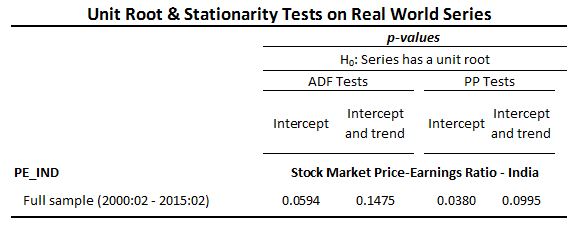

# IMF Online Course: Macroeconomic forecasting
## Module 3B: Statistical Properties of Time Series Data
### Testing for Nonstationarity and Unit Roots

**Author**: Miha Trošt   
**Date**: `r format(Sys.Date(), "%d-%m-%Y")`

```{r global_options, include=FALSE}

knitr::opts_chunk$set(echo = TRUE, 
                      message = FALSE, 
                      eval = TRUE, 
                      comment = "", 
                      warning = FALSE,
                      fig.width = 6, 
                      fig.height = 6,
                      fig.align='center',
                      dpi = 100,
                      bootstrap.thumbnail = FALSE)

options(width = 100)

```

```{r}

# useful libraries
library(plyr)
library(dplyr)
library(forecast)
library(stringr)
library(lubridate)
library(tidyr)
library(broom)
library(urca)

```

```{r}

my_wd <- 
  "C:/Users/Miha/Documents/GitHub/IMF_Macro_Forecasting_R/002_module_3a_Statistical_properties_of_time_series/Module3_data/"

# m3_data <- 
#   read.csv(str_c(my_wd, "module3_data_Identifying_ARMA.csv"), 
#            sep = ",")

my_df <- 
  read.csv(str_c(my_wd, "module3_data_PE_Ratios.csv"), 
           sep = ",",
           stringsAsFactors = FALSE)
# 
# my_non_st_df <- 
#   read.csv(str_c(my_wd, "module3b_data_Simulated_Nonstationary.CSV"),
#            sep = ",",
#            stringsAsFactors = FALSE)

```

### Stationarity or Nonstationarity?

Optional: Replicate the results in the table below. Use the command pe_ind.uroot(adf,exo=const) and pe_ind.uroot(adf,exog=trend) to replicate the results for the ADF test with a constant and with a constant and a trend respectively. You can change the “adf” option to “pp” to produce the PP tests. 



#### Replicating the table with unit root tests

```{r}

my_pe_ind_df <-
  my_df %>% 
  select(date, pe_ind) %>%
  filter(complete.cases(.))

my_lags <- 5
stationarity_tests <- list()

# ADF unit root test

stationarity_tests$adf_drift <- 
  ur.df(my_pe_ind_df$pe_ind, type = "drift", 
        lags = my_lags, selectlags = "AIC") %>% 
  summary

stationarity_tests$adf_trend <- 
  ur.df(my_pe_ind_df$pe_ind, type = "trend",
        lags = my_lags, selectlags = "AIC") %>% 
  summary

# Phillips - Perron unit root test

stationarity_tests$pp_constant <- 
  ur.pp(my_pe_ind_df$pe_ind, 
        type = "Z-tau", model = "constant", lags = "long") %>% 
  summary

stationarity_tests$pp_trend <- 
  ur.pp(my_pe_ind_df$pe_ind, 
        type = "Z-tau", model = "trend", lags = "long") %>% 
  summary

# KPSS stationarity test

stationarity_tests$kpss_mu <- 
  ur.kpss(my_pe_ind_df$pe_ind, type = "mu", lags = "long") %>% 
  summary

stationarity_tests$kpss_tau <-   
  ur.kpss(my_pe_ind_df$pe_ind, type = "tau", lags = "long") %>% 
  summary
```

#### QUESTION 3.40

Given that in both cases the coefficient on the trend term is not statistically significant, using a 10 percent level of significance, the test results suggest that pe_ind is:

```{r}

stationarity_tests[1:4]

```

Answer: Stationary

#### QUESTION 3.41

Run the KPSS test for pe_ind (see question 3.40 and replace “adf” with “kpss” in the command options of uroot). Based on the result, the variable pe_ind is (Hint: If the KPSS statistic is smaller than the x% level critical value then one cannot reject the null-hypothesis at the x% level and recall that the null hypothesis is that pe_ind is stationary):

Using a 10 percent level of significance, the KPSS test implies that pe_ind is:

```{r}

stationarity_tests[5:6]

```

Answer: Stationary

### Video lecture

Create near unit root series: y

y~t~ = 0.5 + 0.96 * y~t-1~ + 2 * e~t~; e~t~ = rnorm(n, mean = 0, sd = 2)

Trend stationary series: x

x~t~ = 0.5 + 0.75 * x~t-1~ + 0.01 * trend + e~t~; e~t~ = rnorm(n, 0, 1.5)

Random walk series: z

z~t~ = 0.8 + z~t-1~ + e~t~; e~t~ =  rnorm(n, 0, 1)

```{r arima_sim}

# number of observations in simulation
n <- 1382

# Near unit root series: y
y <- vector()
y <- 0

e_y <- rnorm(n, sd = 2)

for(i in 2:n){
  
  y[i] <- 0.5 + 0.96 * y[i - 1] + e_y[i]
  
}

# Trend stationary series: x
x <- vector()
x <- 0

e_x <- rnorm(n, sd = 1.5)
trend <- 1:n

for(i in 2:n){
  
  x[i] <- 0.5 + 0.75 * x[i - 1] + 0.01 * trend[i] + e_x[i]
  
}

# Random walk series: z
z <- vector()
z <- 0

e_z <- rnorm(n)

for(i in 2:n){
  
  z[i] <- 0.8 + 1 * z[i - 1] + e_z[i]
  
}

```

```{r}
# number of observations in sample
n_sample <- 121

my_ts <- cbind(z, y, x)

# plot last n_sample observations
plot.ts(tail(my_ts, n_sample))

```

### Stationarity test: ADF, PP, KPSS

```{r}

my_ts_df <-
  my_ts %>% 
  as.data.frame 

my_lags <- 5
stationarity_tests <- list()

# ADF unit root test

stationarity_tests$adf_none <- 
  lapply(my_ts_df, 
         function(x) {ur.df(x, 
                            type = "none",
                            lags = my_lags, 
                            selectlags = "AIC") %>% summary
           }
         )

stationarity_tests$adf_drift <- 
  lapply(my_ts_df, 
         function(x) {ur.df(x, 
                            type = "drift",
                            lags = my_lags, 
                            selectlags = "AIC") %>% summary
           }
         )

stationarity_tests$adf_trend <- 
  lapply(my_ts_df, 
         function(x) {ur.df(x, 
                            type = "trend",
                            lags = my_lags, 
                            selectlags = "AIC") %>% summary
           }
         )

# Phillips - Perron unit root test

stationarity_tests$pp_constant <- 
  lapply(my_ts_df,
         function(x) {ur.pp(x,
                            type = "Z-tau", 
                            model = "constant", 
                            lags = "long") %>%  summary
           }
         )

stationarity_tests$pp_trend <- 
  lapply(my_ts_df,
         function(x) {ur.pp(x,
                            type = "Z-tau", 
                            model = "trend", 
                            lags = "long") %>%  summary
           }
         )

# KPSS stationarity test

stationarity_tests$kpss_mu <- 
  lapply(my_ts_df, 
         function(x){ur.kpss(x,
                             type = "mu",
                             lags = "long") %>%  summary
           }
         )

stationarity_tests$kpss_tau <-   
  lapply(my_ts_df, 
         function(x){ur.kpss(x,
                             type = "tau",
                             lags = "long") %>%  summary
           }
         )

stationarity_tests

```

### Running Different Tests

Open the EViews workfile “Module3B_data.wf1”, pagefile “Simulated_full_sample”. 

During the video lecture, we conducted tests on three simulated series: y (a near-unit root series), z (a random walk) and x (a trend stationary series). Using the full sample of data (1,381 observations), the goal of this section is to ascertain that z is I(1) by running the three tests (ADF, PP, and KPSS) on its first-difference.

#### QUESTION 3.42

For the first difference of z, do the ADF or PP tests fail to reject the null hypothesis of a unit root for any of the specifications (constant/constant and trend)?

Hint: Please note that by adding the option “dif=1” in the uroot command, EViews runs the test for the first difference of the variable e.g. z.uroot(adf,exog=trend,dif=1) for the ADF test of z with a constant and a trend (with a constant only replace "exog=trend" with "exog=const"). You can change the “adf” option to “pp” to produce the PP tests.

```{r}
my_diff_ts <- 
  my_ts_df %>% 
  mutate_each(funs(. - lag(., 1))) 

my_diff_ts %>% 
  plot.ts

```

All time series x, y, z appear to be stationary in first differences.

```{r}

my_df <- 
  my_diff_ts %>% 
  filter(complete.cases(.)) %>% 
  select(z) %>% 
  unlist %>% 
  unname

my_lags <- 5

stationarity_tests_diff <- list()

# ADF unit root test

stationarity_tests_diff$adf_drift <- 
  ur.df(my_df, type = "drift", 
        lags = my_lags, selectlags = "AIC") %>% 
  summary

stationarity_tests_diff$adf_trend <- 
  ur.df(my_df, type = "trend",
        lags = my_lags, selectlags = "AIC") %>% 
  summary

# Phillips - Perron unit root test

stationarity_tests_diff$pp_constant <- 
  ur.pp(my_df, 
        type = "Z-tau", model = "constant", lags = "long") %>% 
  summary

stationarity_tests_diff$pp_trend <- 
  ur.pp(my_df, 
        type = "Z-tau", model = "trend", lags = "long") %>% 
  summary

# KPSS stationarity test

stationarity_tests_diff$kpss_mu <- 
  ur.kpss(my_df, type = "mu", lags = "long") %>% 
  summary

stationarity_tests_diff$kpss_tau <-   
  ur.kpss(my_df, type = "tau", lags = "long") %>% 
  summary

```

Answer is NO.

#### QUESTION 3.43

Do both specifications of the KPSS test yield results consistent with those of the ADF and PP tests?

Answer: Yes.

#### Optional Question, No Single Answer

To gain more familiarity with these tests, in the same Tab in EViews, simulate another nonstationary series v[1], then (i) conduct the three tests (for different specifications) on the level of v, its first-difference, and so on so as to determine its order of integration (that is, stop differencing once the tests indicate stationarity) (ii) after conducting this analysis for the full sample, choose a subsample and repeat. Do the results change? If so, how?

[1] You can easily adapt the program file "nonstationary_simulations.prg” to simulate additional series.
