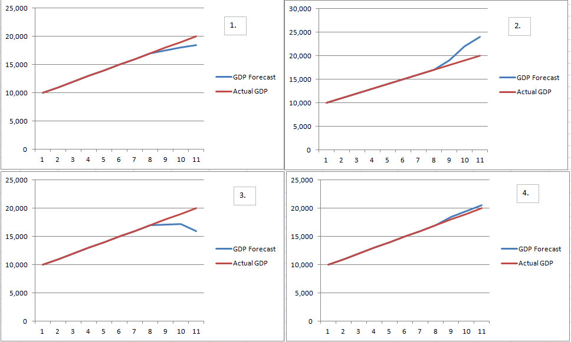
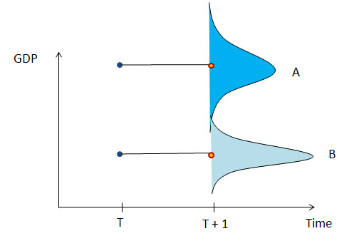
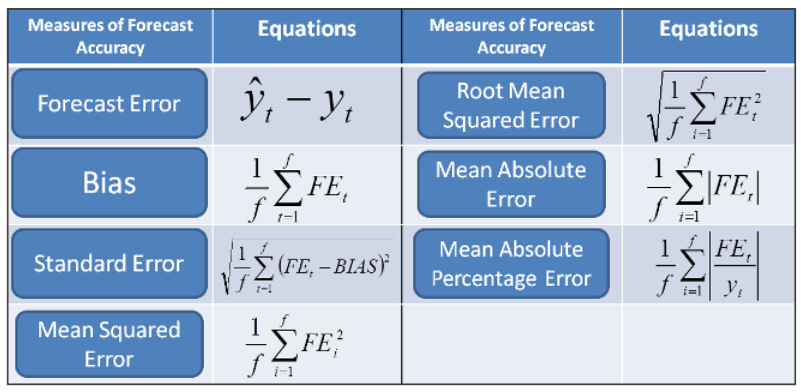
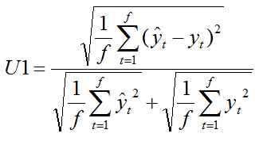
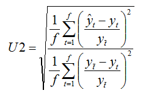

# IMF Online Course: Macroeconomic forecasting
## Module 4: Forecast Uncertainty and Model Evaluation

**Author**: Miha Trošt   
**Date**: `r format(Sys.Date(), "%d-%m-%Y")`

```{r global_options, include=FALSE}

knitr::opts_chunk$set(echo = TRUE, 
                      message = FALSE, 
                      eval = TRUE, 
                      comment = "", 
                      warning = FALSE,
                      fig.width = 6, 
                      fig.height = 6,
                      fig.align='center',
                      dpi = 100,
                      bootstrap.thumbnail = FALSE)

options(width = 100)

```

```{r}

# useful libraries
library(plyr)
library(dplyr)
library(forecast)
library(stringr)
library(lubridate)
library(tidyr)
library(broom)
library(xts)

```

```{r}

my_wd <- 
  "C:/Users/Miha/Documents/GitHub/IMF_Macro_Forecasting_R/003_module_3b_Statistical_properties_of_time_series/M3B_Assessments Workfile/"

my_non_st_df <- 
  read.csv(str_c(my_wd, "module3b_data_Simulated_Nonstationary.CSV"),
           sep = ",",
           stringsAsFactors = FALSE)

```

### Introduction

#### Question 4.1

In this module, you will learn: (Select all that apply)

Answer: 
1. How to choose between forecasts from competing models/sources.
2. How to assign numbers to a forecast using key statistics and their interpretation.
3. How to forecast using different strategies.
4. How to visualize forecast uncertainty using fan charts.
5. How to forecast and interpret forecast statistics in EViews. 

#### Question 4.2 
 
A `within-sample` forecast assessment:

Answer:
Uses known/actual values of the dependent variable that are not part of the sample used to estimate the model. 

#### Question 4.3

An ideal model has:

Answer: low bias and low uncertainty

### Sources of Uncertainty Part 1

The following questions will assess your understanding of forecast models and their sources of error.

#### Question 4.4

In the case of a continuous stochastic process, the probability of an economic forecast being exactly correct is equal to:

Answer: 0

#### Question 4.5 

DGP stands for:

Answer: Data Generation Process

#### Question 4.6

The error terms can be considered `white noise` if:

Answer is **both**: 

* they are independent and identically distributed

* the expected value of the error term is equal to 0

### Sources of Uncertainty Part 2

These questions will assess knowledge of common sources of uncertainty in macro forecasting.

#### Question 4.7 (Optional) 
 
True or False: In general, the more exogenous variables we must forecast to obtain a forecast for the dependent variable, the greater the uncertainty of our forecast.

Answer: TRUE

#### Question 4.8 (Optional) 

Which of the following are sources of forecast uncertainty? Select all that apply:

Answer: All apply

* Error term in the DGP 
* Stochastic exogenous variables
* An unknown DGP
* Unknown parameters in the DGP 
* Measurement errors in exogenous variables 
* Model misspecification
* Poor data quality
* Poor parameter estimation 

### Forecast Assessment

These questions will assess knowledge of common statistical measures of forecast uncertainty.

#### Question 4.9 
 
Which of the following graphs display an optimistic bias relative to the actual outcome? Select all that apply:



Answer: 2 and 4

#### Question 4.10

Which of the following forecasts of GDP has the smaller error variance?



Answer: Forecast Distribution B

#### Question 4.11 
 
In the lecture we discussed 7 statistics for forecast evaluation. Drag and drop the following statistics next to their appropriate equations:

Answer:  

#### Question 4.12

Fill-in the following statement by choosing from the drop down box.

The `RMSE` is particularly vulnerable to outliers and `does` take into account the bias of the forecast.

#### Question 4.13 (Optional) 
 
True or False: Usually there is a tradeoff between forecast accuracy and the number of parameters that must be estimated in an economic model.

Answer: True

#### Question 4.14 

Fill-in the following statement by choosing from the drop down box.

At the beginning of the forecasting period, as the time horizon increases the forecast uncertainty `increases`.

Over time the forecast uncertainty (assuming the variable is well behaved i.e. stationary) `stabilizes at a specific level`.
 
#### Question 4.15

The `___` model is a simple appropriate benchmark for forecast evaluation.

Answer: Naive

### Calculating AR(1) Forecasts for Thailand

```{r}
thai_df <- 
  read.csv("C:/Users/Miha/Documents/GitHub/IMF_Macro_Forecasting_R/004_module_4_Forecast_uncertainty_and_Model_evaluation/Module_4_Workfile/Thailand_M.csv", 
           stringsAsFactors = FALSE)

thai_df <- 
  thai_df %>% 
  mutate(dateid01 = as.Date(dateid01)) %>% 
  filter(year(dateid01) < 2014)

my_min_max_date <-
  thai_df %>% 
  summarise(my_min_year = min(year(dateid01)),
            my_max_year = max(year(dateid01)))

thai_ts <- 
  ts(thai_df$p, start = my_min_max_date[, 1], frequency = 12)
```

Assume that you are in December 2013 and just observed inflation in December 2013. You are interested in forecasting monthly year-on-year inflation for all months of 2014. In other words, you would like to perform a dynamic forecast. Please refer to the `Data` tab of the `Thailand Forecast Statistics` file for the actual data on inflation and the AR(1) model that was estimated (cells F3:N20).

```{r}

# fit ar1 model
thai_ar1_fit <- Arima(thai_ts, order = c(1, 0, 0))

# forecast and plot
forecast(thai_ar1_fit, h = 12) %>% plot(., las = 1) %>% abline(h = 0)

```

#### Question 4.16

Using the AR(1) model, the forecast of Thai inflation for December, 2014 is:

Insert your answer to two decimal places as shown by Excel and make sure to include the % sign (Hint: See `Data` tab cells D135:D146).

Answer: 2.35% 

### Thai Forecast Statistics

Now refer to the `Forecast AR1` sheet of the `Thailand Forecast Statistics` file. In this sheet, we have forecasts from the AR(1) model and benchmark naive model in Columns C and D, respectively. Note that the __dynamic forecasts__ of the naive model will always be 1.66 % for the entire year.

The spreadsheet will calculate: 

1. the average, 
2. the standard deviation and 
3. the correlation with the actual observations, for both models.

Let's compare the performance of the AR(1) model to that of a naive model. By the end of the exercise, you will be able to calculate the forecast statistics in rows 22-28.

#### Question 4.17

Fill-in the following statement by choosing from the drop down box.

The average forecast of inflation using the AR1 model is `closer to` the actual average than the average of the naive model. The standard deviation of the AR1 model is `greater than` than the standard deviation of the naive model.

_Explanation from the Imf Staff: The average of AR1 (2.080 %) is closer to the average actual inflation (1.898 %) than is the average of the naive model (1.660 %). In other words, AR(1) has a smaller absolute bias. However, the standard deviation of the first model (f1) is greater. This makes sense, as the standard deviation of f2 is 0._

#### Question 4.18

Calculate the observed errors for the AR1 model.

Fill-in the blank: The AR1 model performs the worst in `December` of 2014 while the naive model performs the worst in `December` of 2014.

_Explanation from the Imf Staff: The forecast error/observed error (e1) of the first model is the largest in December. In December, actual inflation was 0.62 %, while the inflation forecast (f1) was 2.35 %, an error (e1) of 1.73 %. Similarly, the error of the naive model (e2) is also the largest in December (1.04 %). Both forecasts over-predicted inflation for the month of December._

#### Question 4.19

Compare the forecast bias of the AR1 and naive models and link these numbers to the appropriate cells in the `Forecast Evaluation Statistics` table below the data.

Fill-in the following statement by choosing from the drop down box.

The absolute value of the bias of the naive model is `greater` than that of the AR1 model.

_Explanation from the Imf Staff: Remember that the bias of a set of forecasts is the average observed error. Thus to calculate the bias for the models, sum the observed errors and divide by the number of forecasts. The bias for the AR(1) model is approximately 0.183, while the for the naive model it is -0.238. Thus, the AR(1) model, on average, tends to over-predict inflation while the naive, on average, under-predicts it._

#### Question 4.20

As we did in the lecture, calculate the squared error for the AR(1) model over all months of 2014. Then determine the mean squared error (MSE) for AR(1). Fill in the RMSE row as well by taking the square root of your value.

Fill-in the following statement by choosing from the drop down box.

The mean square error (MSE) of the AR1 model is `greater` than that of the naive model.

_Explanation from the Imf Staff: The MSE of the AR1 model can be found by taking the average of the sum of squared errors for all 12 months of 2014. The MSE of AR1 is approximately 0.492. Performing the same calculation for the naive model yields a MSE of 0.351 %. The root mean square error (RMSE) for the AR1 model, reported by EViews, is necessarily greater too._

#### Question 4.21

Calculate the standard forecast error for the AR(1) model.

Fill-in the following statement by choosing from the drop down box.

The SE of the AR1 model is `greater than` the SE of the naive model.

_Explanation from the Imf Staff: The SEs of both models can be found by taking the square root of the difference between the MSE and the bias-squared. For the AR1 model, the SE= sqrt(0.492 - 0.183^2) = 0.68. The SE of the naive model is similarly = sqrt(0.351 – -0.238^2) = 0.54._

#### Question 4.22 (Optional) 
 
As we did in the lecture, calculate the absolute error for AR(1) (Column J) over all months of 2014. Using these numbers, determine the mean absolute error (MAE) for the AR1 model.

Fill-in the following statement by choosing from the drop down box.

The mean absolute error (MAE) of the AR1 model is `about the same as` that of the naive model.

_Explanation from the Imf Staff: The MAE of both models can be found as the average of the absolute errors over all months of 2014. The MAE of the AR1 model is 0.515 compared to 0.516 for the naive, essentially the same._

#### Question 4.23 
 
As we did in the lecture, calculate the percentage error and absolute percentage error for AR(1) over all months of 2014. Then determine the mean percentage error (MPE) and the mean absolute percentage error (MAPE) for the AR1 model.

Fill-in the following statement by choosing from the drop down box.

In absolute terms, the MPE for the AR1 model is `greater` that of the naive model.
 
The MAPE for the AR1 model is `greater` that of the naive model.

_Explanation from the Imf Staff: The MPE of the AR1 model is approximately 30.77 % compared to 1.465 % for the naive. In absolute terms, the AR1 model’s MAPE is larger at 44.943 than that of the naive model (34.551)._

This section is optional and therefore questions 31 to 36 are not graded. We encourage you to still go through it to familiarize yourself with U-statistics and various proportions. Note that you will use the same `Thailand Excel File` from the Session 3 Workshop. Make sure to use your saved file from the last workshop when completing this one. Numerical answers are to two decimals (use Excel rounding).

### Calculating U1

Refer back to the “Forecast AR1” sheet of the “Thailand Excel File”.  Now we’re going to calculate some Theil statistics. By the end of the exercise, you will be able to calculate the forecast statistics in rows 29-33. 

Let’s calculate the U1 statistic for  the AR1model. First, perform the necessary calculations in column R for all months of 2014. Then use the averages to calculate U1 for AR1.

Hint: Remember that:



#### QUESTION 4.31 (OPTIONAL)  

Fill-in the following statement by choosing from the drop down box.

Theil’s U1 is smaller for the `naive` model.

### Calculating U2

Let’s calculate the U2 statistic for the AR1 model. First, perform the necessary calculations in column T for all months of 2014. 

Hint: Remember that when forecasting multiple periods ahead: 



Recall that `t with straight line` in this case is December 2013 (the last observed data point). As the forecast is dynamic, the naive model predicts that y will always be equal to its latest available observation which is December 2013. Also please note that this formulation of U2 essentially implies that by using U2 to assess forecast performance we compare the RMSE of the benchmark model to the RMSE of the naive model.

Note: As the forecast is dynamic in this case the denominator in the formula above is different from the one shown in the video/lecture slides (slide 51) which shows the U2 statistic for one-step ahead forecasts.

#### QUESTION 4.32 (OPTIONAL)  

The numerator of the U2 statistic (without the square root) for the AR1 model is: (Insert your answer to two decimal places)

Answer: 0.18

The denominator of the U2 statistic (without the square root) for both models is: (Insert your answer to two decimal places)

Answer: 0.13

#### QUESTION 4.33 (OPTIONAL)

Calculate the Theil U2 for the AR(1) model based on your answers to the previous question.

The resulting U2 statistic for the AR1 model is: (Insert your answer to two decimal places)

Answer: 1.18

#### QUESTION 4.34 (OPTIONAL)

True or False: Based on its U2 statistic, the AR1 model performs better than the naive model.

Answer: False

#### QUESTION 4.35 (OPTIONAL)

Finally, let’s calculate the bias, variance and covariance proportions for both models.

The bias proportion for the AR1 model is: (Insert your answer to two decimal places)

Answer: 0.07

The variance proportion for the AR1 model is: (Insert your answer to two decimal places)

Answer: 0.25

The covariance proportion for the AR1 model is: (Insert your answer to two decimal places)

Answer: 0.68

#### QUESTION 4.36 (OPTIONAL)

True or false: based on the proportions you calculated, the AR1 model performs better than the naive model.

Answer: True
 
 


