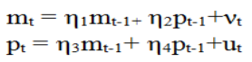

---
output:
  html_document:
    highlight: textmate
    theme: journal
---

# IMF Online Course: Macroeconomic forecasting
## Module 6: Cointegration & Vector Error Corrections Models (VECMs)

**Author**: Miha Trošt   
**Date**: `r format(Sys.Date(), "%d-%m-%Y")`

```{r global_options, include=FALSE}
knitr::opts_chunk$set(echo = TRUE, 
                      message = FALSE, 
                      eval = TRUE, 
                      comment = "", 
                      warning = FALSE,
                      fig.width = 8, 
                      fig.height = 4,
                      # fig.align='center',
                      # dpi = 100,
                      bootstrap.thumbnail = FALSE)

options(width = 100)
```

```{r}
# useful libraries
library(plyr)
library(dplyr)
library(forecast)
library(stringr)
library(lubridate)
library(tidyr)
library(broom)
library(xts)
library(ggplot2)
library(GGally)

library(urca)
# library(vars)
```

## Session 1: Introduction

### Before you Start...

The country data you will be analyzing is from `Austria`.

Remember to have open the EViews workfile `M6_data.wf1.` and select the pagefile called AUT (i.e., our country code for Austria). As you learned in Module 3, run the Augmented Dickey-Fuller unit root test for each one of the variables for the full sample: p, m and rgdp (all in logs). To do so, use the EViews command `uroot` e.g. run (enter the text then return in the command window):

```
smpl @all

genr ln_p = log(p)

ln_p.uroot(adf, const, maxlag = 15, info = sic) 
```

for testing whether log(p) (i.e., ln_p) is stationary and adapt this code for the other two variables, m and rgdp.

```{r}

my_df <- 
  read.csv("C:/Users/Miha/Documents/GitHub/IMF_Macro_Forecasting_R/006_module_6_Cointegration_and_Vector_error_correction_models_VECMs/r_data/Module6_Worfile_AUT.csv", 
           stringsAsFactors=FALSE)

# filtering dataset and logarithmic transformation of variables
my_sample <-
  my_df %>%
  select(-dateid) %>% 
  filter(dateid01 > "2000", dateid01 < "2013") %>% 
  mutate_each(funs(log), -dateid01) 
```

```{r}
# line chart
my_chart_data <- 
  my_sample %>%
  select(dateid01, m:rgdp) %>%
  gather(variable, value, -dateid01) %>% 
  mutate(dateid01 = as.Date(ymd(dateid01))) 

ggplot(my_chart_data, aes(x = dateid01, y = value)) +
  geom_line() +
  facet_wrap(~ variable, scales = "free_y") + 
  geom_smooth(method = 'lm', formula = y ~ x) +
  theme(axis.text.x = element_text(angle = 45, hjust = 1)) +
  ggtitle("Trending time series variables") +
  theme(plot.title = element_text(lineheight = 1.1, vjust = 0.5, face = "bold"))
```

```{r}
# scatterplot
my_sample %>%
  select(m:rgdp) %>% 
  gather(variable, value, -p) %>% 
  ggplot(aes(x = p, y = value, color = variable)) +
  geom_point() + 
  facet_wrap(~ variable, scales = "free") +
  geom_smooth(method = 'lm', formula = y ~ x) +
  ggtitle("Correlation between variable p and other variables (m, rgdp)") +
  theme(plot.title = element_text(lineheight = 1.1, vjust = 0.5, face = "bold"))
```

#### QUESTION 6.1 

Using only a constant term for the deterministic part of the regression, the maximum feasible sample (i.e., `smpl @all`) and the default SIC lag order selection criterion, report the probability (p-value) associated with the ADF test for each one of the variables (report the first two decimal places, no rounding). 

Can you reject or not the null hypothesis that each variable has a unit root at the 5 % level?

```{r}
# stationarity tests
my_lags <- 5
stationarity_tests <- list()

my_adf_data <-
  my_sample %>%
  select(m:rgdp)

# ADF for all time seria
for(ts in 1:ncol(my_adf_data)){
  
# ADF unit root test
stationarity_tests[[ts]] <- 
  ur.df(my_adf_data[, ts], 
        type = "drift", 
        lags = my_lags, 
        selectlags = "BIC") %>% summary
}
```

__Log(m)__: ADF statistics and critical values

```{r}
slot(stationarity_tests[[1]], "teststat")
slot(stationarity_tests[[1]], "cval")
```

Answer: Cannot reject

_**Explanation from IMF Staff**: The ADF test indicates a p-value of 0.78, meaning that we cannot reject the null hypothesis of a unit root for log(m)._

__Log(p)__: ADF statistics and critical values

```{r}
slot(stationarity_tests[[2]], "teststat")
slot(stationarity_tests[[2]], "cval")
```
 
Answer: Cannot reject

_**Explanation from IMF Staff**: The ADF test indicates a very high p-value of 0.98, meaning that we cannot reject the null hypothesis of a unit root for log(p)._

__Log(rgdp)__: ADF statistics and critical values

```{r}
slot(stationarity_tests[[3]], "teststat")
slot(stationarity_tests[[3]], "cval")
```

Answer: Cannot reject

_**Explanation from IMF Staff**: The ADF test indicates a p-value of 0.13, meaning that we cannot reject the null hypothesis of a unit root. Please see the EViews test performed below:_


#### QUESTION 6.2 

Instructions: In Eviews, generate the following variable which is an arbitrary linear combination of the I(1) variables log(m), log(p) and log(rgdp) using the following command: 

```
genr arbitrary_linc = 0.3 * log(m) - 0.5 * log(p) + 0.1 * log(rgdp)
```

Plot the graph of this new variable and run the ADF unit root test with the same specification as in question Q6.1 above.

Report below the result of your unit root test for variable `arbitrary_linc` (see instructions above), in terms of probability (p-value) and whether you can reject or not the null hypothesis of a unit root (report the first two decimal places, no rounding):


```{r}
# data is already in logarithms
my_adf_data <- 
  my_sample %>%
  mutate(dateid01 = as.Date(ymd(dateid01)),
         arbitrary_linc = 0.3 * m - 0.5 * p + 0.1 * rgdp) 

my_adf_data %>% 
  ggplot(., aes(x = dateid01, y = arbitrary_linc)) +
  geom_line() +
  ggtitle("Arbitrary linear combination among nonstationary variables") +
  theme(plot.title = element_text(lineheight = 1.1, vjust = 0.5, face = "bold"))
```


```{r}
# ADF unit root test
my_adf_test_arb_linc <-
  my_adf_data[, "arbitrary_linc"] %>% 
  ur.df(., type = "drift", lags = my_lags) %>% 
  summary
```

Probability:

```{r}
slot(my_adf_test_arb_linc, "teststat")
slot(my_adf_test_arb_linc, "cval")
```

Answer: Cannot reject

_**Explanation from IMF Staff**: The plot shows that the variable does not look like a stationary variable and the unit root test confirms this result. In general a linear combination of I(1) variables is NOT I(0) and as we will see in future sessions it is not I(0) in general even for co-integrated variables._
 


#### QUESTION 6.3 

What kind of issues could arise if one or more non-stationary variables are included in a VAR? 

Select all that apply:

* The impulse responses could be unreliable at longer horizons because they do not decay.
* Granger causality tests do not follow the standard F-test.   

_**Explanation from IMF Staff**: As mentioned in the lecture, the inclusion of non-stationary variables in a VAR could result in unreliable impulse responses that do not decay over time. Granger causality tests will also be skewed and not as reliable. Tests losing power is related to using a VAR in levels vs. a VAR in differences, in which case the former has one more lag for each endogenous variable. Tests may lose power in this case. Including non-stationary variables in a VAR would not cause tests to lose power in all cases._
  
#### QUESTION 6.4 

Time series Xt, Yt and Zt are said to be cointegrated if:

Xt, Yt and Zt are all I(1) and there exists constants a, b and c such that: aXt+bYt+cZt is I(0). 

_**Explanation from IMF Staff**: Time series Xt, Yt and Zt would be considered to be cointegrated if they are all I(1) and there exists constants such that a linear combination of the 3 variables would be stationary._

#### QUESTION 6.5 

Which of the following statements is a correct description of the concept of cointegration (Hint: See Session 1 video around 5:25):

It is a purely statistical concept. 

_**Explanation from IMF Staff**: As mentioned previously, cointegration is a purely statistical concept, not necessarily an economic one. While economic theories may help to illustrate the principle, the idea behind cointegration is based largely on mathematical theory and statistics._

#### QUESTION 6.6 

The equilibrium of the money market might explain why m, p, y and r (log money, log price, log real GDP and interest rate) are cointegrated (provided they are I(1)) because:


_**Explanation from IMF Staff**: The second choice is the answer. Otherwise the theory would be missing some important elements._

## Session 2A: Error Correction Discussion

#### QUESTION 6.7

In which case(s) would the system below, where m~t~* = b * p~t~, always converge to a point where m~t~ = b * p~t~, following a deviation from it? 

Select all that apply:

(Hint: use the diagram shown in the video):


_**Explanation from IMF Staff**: Of the cases above, three would cause the system to return to its long-run equilibrium. The remaining choice would cause further divergence after the deviation._

#### QUESTION 6.8

In the previous question. what is your intuition about the second option for adjustment?


_**Explanation from IMF Staff**: If a~m~ is negative and a~p~ is zero, then m~t~ would do all of the error correction. If a~m~ was equal to 0, and a~p~ is positive, then p~t~ would do all of the correcting (and money would seem to be exogenous). Finally, if a~m~ was negative and a~p~ was positive, this would indicate that both variables would perform some of the correction._

## Session 2B: Error Correction in Eviews Discussion

```{r}
n <- 2000

# error correction coefficients
c1 <- 0.05; c2 <- -0.05
c3 <- 0.005; c4 <- -0.005

# simulate random (white) noise u
# reproducibility seed for u
set.seed(123)
u <- diff(cumsum(rnorm(n)))

# simulate random (white) noise w
# reproducibility seed for w
set.seed(1234)
w <- diff(cumsum(rnorm(n)))
```

```{r}
# my random (white) noise u and w
as.data.frame(cbind(u, w)) %>%
  add_rownames %>% 
  gather(variable, value, -rowname) %>%
  mutate(my_time_index = as.integer(rowname)) %>% 
  ggplot(., aes(x = my_time_index, y = value, color = variable)) +
  geom_line() +
  ggtitle("Simulated random (white) noise processes") +
  theme(plot.title = element_text(lineheight = 1.1, 
                                  vjust = 0.5, 
                                  face = "bold"))
```

```{r}
# random walk x 
x <- vector(); x[1] <- 0

for(i in 2:n){
  x[i] <- x[i - 1] + u[i]
}

# random walk y
y <- vector(); y[1] <- 0

for(i in 2:n){
  y[i] <- y[i - 1] + w[i]
}

# distance between random walks y and x
diff_y_x <- y - x

```

```{r}
# my cointegrated processes
# x1
x1 <- vector(); x1[1] <- 0

# y1
y1 <- vector(); y1[1] <- 0

# x2
x2 <- vector(); x2[1] <- 0

# y2
y2 <- vector(); y2[1] <- 0

# generating cointegrated processes
for(i in 2:n){
  x1[i] <- u[i] + x1[i - 1] + c1 * (y1[i - 1] - x1[i - 1])  
  y1[i] <- w[i] + y1[i - 1] + c2 * (y1[i - 1] - x1[i - 1])
  x2[i] <- u[i] + x2[i - 1] + c3 * (y2[i - 1] - x2[i - 1])  
  y2[i] <- w[i] + y2[i - 1] + c4 * (y2[i - 1] - x2[i - 1])
}

# distance between cointegrated processes y1 and x1
diff_y1_x1 <- y1 - x1

# distance between cointegrated processes y2 and x2
diff_y2_x2 <- y2 - x2

```

```{r}
# plot of simulated data
as.data.frame(cbind(x, y, x1, y1, 
                    diff_y_x, diff_y1_x1)) %>%
  add_rownames %>% 
  filter(complete.cases(.)) %>% 
  gather(variable, value, -rowname) %>%
  mutate(my_time_index = as.integer(rowname),
         variable = as.character(variable),
         my_ts_group = ifelse(str_detect(variable, "diff"),
                              "02_distance", 
                              "01_simulated_process")) %>% 
  ggplot(., aes(x = my_time_index, y = value, color = variable)) +
  geom_line() +
  facet_wrap(~ my_ts_group, scales = "free_y", ncol = 1) +
  ggtitle("Simulated random walks and cointegrated process
          (c_1 = 0.05, c_2 = -0.05)") +
  theme(plot.title = element_text(lineheight = 1.1, 
                                  vjust = 0.5, 
                                  face = "bold"))

# plot of simulated data with lower c_1 and c_2 
as.data.frame(cbind(x, y, x2, y2, 
                    diff_y_x, diff_y2_x2)) %>%
  add_rownames %>% 
  filter(complete.cases(.)) %>% 
  gather(variable, value, -rowname) %>%
  mutate(my_time_index = as.integer(rowname),
         variable = as.character(variable),
         my_ts_group = ifelse(str_detect(variable, "diff"),
                              "02_distance", 
                              "01_simulated_process")) %>% 
  ggplot(., aes(x = my_time_index, y = value, color = variable)) +
  geom_line() +
  facet_wrap(~ my_ts_group, scales = "free_y", ncol = 1) +
  ggtitle("Simulated random walks and cointegrated process
          (c_1 = 0.005, c_2 = -0.005)") +
  theme(plot.title = element_text(lineheight = 1.1,
                                  vjust = 0.5, 
                                  face = "bold"))

```

## Session 3: VECM specification

As seen in the video, the Error Correction Model of Session 2 could be rewritten as:


which is reminiscent of a VAR representation where:



#### QUESTION 6.13

What is the implicit relationship between the parameters `n1`, `n2`, `n3`, `n4`?

Hint: One can show for example that by construction (1 + a~m~) = n1 and -a~m~ * b = n2 which implies that a~m~ = n1 - 1 and n2 / (n1 - 1) = –b.


_**Explanation from IMF Staff**: As indicated in the hint, the relationship between these constraints would be non-linear._

#### QUESTION 6.14

As mentioned in the Session 3 video, it is necessary to select the lag length of the VECM. To do so we need first to __select the lag length of the VAR in levels__ using the same endogenous variables, then __subtract one__. 

As you learned in Module 5, run a VAR in levels using `log(m)`, `log(p)` and `log(rgdp)` as endogenous variables (using two lags, say, initially).

Check the lag order selection criteria. Using a maximum lag setting length of 8, what is:

* the recommended number of lags according to the SC criterion?

* the recommended number of lags according to the HQ criterion?

* the recommended number of lags according to the AIC criterion? 

```{r}

my_var_ts <-
  my_sample %>% 
  select(-dateid01, -i)

vars::VARselect(my_var_ts, lag.max = 8, type = "const")$selection

```

_**Explanation from IMF Staff**: Running the 3-variable VAR described above with two lags, and selecting Lag Specification Criteria in the VAR window yields the results below:_


_Both the Schwarz and Hannan-Quinn suggest one lag, while the Akaike criterion suggests 7. Note that the answer is conditional on the maximum lag length setting. It may change if you use a higher maximum lag setting (since the result is dependent on the residual sum of squares of the model)._

#### QUESTION 6.15

If we would like our model to be __as parsimonious as possible__, which of the results would you select (how many lags would you include)?

```{r}
vars::VARselect(my_var_ts, lag.max = 8, type = "const")$selection %>% min()
```

_**Explanation from IMF Staff**: With 7 lags we would lose too much data and we have a lot of parameters to estimate._

#### QUESTION 6.16

However, we need to check for this selected lag length whether the residuals are autocorrelated. We run the test for the lag order of one but we found that there is still autocorrelation of the residuals (you could optionally check this result). Usually, one would select a higher lag order and verify if there is still autocorrelation of the residuals. 

Let us select a lag order of 2 and check the residuals using an LM autocorrelation test (click on View/Residuals test/Autocorrelation LM test [with 4 lags]). What is your reading of the results?

```{r}
my_var <- vars::VAR(my_var_ts, p = 2)

as.data.frame(resid(my_var)) %>%
  add_rownames() %>%
  mutate(time_index = as.integer(rowname)) %>% 
  gather(variable, value, -rowname, -time_index) %>% 
  ggplot(., aes(x = time_index, y = value, color = variable)) +
  geom_line() +
  facet_wrap(~ variable, ncol = 1, scales = "free_y") +
  theme(legend.position = "none") +
  ggtitle("Residuals from VAR") +
  theme(plot.title = element_text(lineheight = 1.1, 
                                  vjust = 0.5, 
                                  face = "bold"))
  
```

```{r}
vars::serial.test(x = my_var, lags.bg = 2, type = "BG")
```


_**Explanation from IMF Staff**:_


#### QUESTION 6.17

Run the VAR in levels using 3 lags this time. Check the LM autocorrelation test for 4 lags. What is your conclusion about the appropriate number of lags?

```{r}
my_var <- vars::VAR(my_var_ts, p = 3)

vars::serial.test(x = my_var, lags.bg = 4, type = "BG")
```


_**Explanation from IMF Staff**: Note that we lose one lag when a VAR in levels is written in difference form._


## Session 3: VECM specification

```{r}
test_statistic <-
  slot(ca.jo(x = my_var_ts, type = "trace", K = 3), "teststat") %>% 
  round(., 2)

my_critical_values <-
  slot(ca.jo(x = my_var_ts, type = "trace", K = 3), "cval")

cbind(test_statistic, my_critical_values)

```

There appears to be one cointegrating relationship in the system of endogenous variables.

According to the Johansen methodology, the rank of the matrix $\Pi$ in the equation below determines the number of independent cointegrating vectors.

$\Delta$X~t~ = C + $\Pi$X~t-1~ + $\Lambda$$\Delta$X~t-1~ + e~t~

Recall that if there are n endogenous variables (which means $\Pi$ has n rows and n columns) and the rank of $\Pi$ is n, then the matrix $\Pi$ is invertible. By pre-multiplying each side of the equation above by the inverse of $\Pi$ (noted inv($\Pi$)) and re-arranging the equation becomes:

X~t-1~ = inv($\Pi$) * $\Delta$Xt – inv($\Pi$) * C - inv($\Pi$) * $\Lambda$$\Delta$X~t-1~ - inv($\Pi$) * e~t~

#### QUESTION 6.18

What can you conclude about X~t~ given the equation above?

Hint: Note that the equation above states that X~t-1~ can be expressed as a linear combination of 3 variables and a constant. Suppose now that X~t-1~ is I(1) and try to find a contradiction. Also recall that the error term (as well as a constant) is I(0) by construction and that a linear combination of I(0) series must be I(0) too. Do the same assuming X~t-1~ is I(0).


_**Explanation from IMF Staff**: Suppose that X~t~ is I(1) then both $\Delta$X~t-1~ and $\Delta$X~t~ are I(0) by definition and e~t~ is also by definition a white noise which means I(0). But X~t~ should be stationary as it is a linear combination of I(0) variables (including the constant). Therefore we have a contradiction. Note: This is not meant to be a formal proof but a simple way to show the relationship between the full rank of the matrix and the stationarity of X~t~._

If the rank is 0 then $\Pi$ = 0. In this case, the equation can be re-written as: 
$\Delta$X~t~ = C + $\Lambda$$\Delta$X~t-1~ + e~t~

#### QUESTION 6.19

Given the equation above, which of the following is correct?

Answer: There is no co-integration relationship among the series composing X~t~ because in the model described above there is no error correction term. There is no co-integration relationship among the series composing X~t~ because in the model described above there is no error correction term. ???

_**Explanation from IMF Staff**: Without the error correction term, the dynamics of the variables will not adjust to converge to the long term relationship following a deviation._

#### QUESTION 6.20

If there are three endogenous variables and the rank is two, then the variables are:

Answer: cointegrated and there exists two interdependent cointegrating vectors.

_**Explanation from IMF Staff**: With three endogenous variables with a rank of two, this indicates that there exist two interdependencies (cointegrating vectors) in the system._

#### QUESTION 6.21

To test for co-integration of a set of variables using the Johansen methodology, what is necessary to do beforehand (Hint: See also the steps used in EViews in the Session 3 video)? Select all that apply:

Answer: 

* See if the variables are non-stationary using visual and formal tests. 

* Determine the lag order of the VAR.

* Specify the form of the deterministic component in the VAR and in the long term relationship.

_**Explanation from IMF Staff**: Before running a Johansen test, it is necessary to verify whether the variables in question are indeed non-stationary. If they are I(0), the test would not be appropriate. It is also necessary to determine the lag order of the VAR; the VECM specification would include one less lag. De-trending is not necessary if we suspect the variables to be I(1). One should also specify the deterministic component in the VAR and in the long run relationship as shown in the video._

#### QUESTION 6.22

Given a set of non-stationary variables, the lag order used in the Johansen test for cointegration is derived from:

Answer: Running a VAR in levels and subtracting one from the level determined. 

_**Explanation from IMF Staff**: As mentioned in several videos, the general strategy is to first run the VAR in levels and subtract one from the result to use as the number of lags in the Johansen test._

### Instructions Eviews

Recall that we are still using the sample 2000q1 to 2012q4 and we will keep working with the data for `Austria` (`AUT pagefile`). Estimate the VECM model for the endogenous variables `log(m)`, `log(p)` and `log(rgdp)` over the period 2000q1 to 2012q4. Click on `Quick, Estimate VAR`. Then make sure to choose `Vector Error Correction` as shown below. Change the `Lag Intervals` for D(endogenous) to the appropriate order i.e. it should be [1 2] instead of [0 0]. Note that we chose 2 because in the previous session we found that 3 was the appropriate lag length for the VAR in levels.


You can run the the cointegration test from the same window by clicking on `View/Cointegration test`. The window that will come up is given below. Note that lag intervals is 1 2 which is what we selected when we estimated the VECM. Also make sure the deterministic trend assumption is set to option 3 which is the standard choice. Then click OK.


```{r}
# in R the lag length has to be equal in VAR and VECM. The routine appearently 
# transformes the lag length in VECM specification
my_lag_vecm <- 3

my_var <- vars::VAR(my_var_ts, p = my_lag_vecm)
```

#### QUESTION 6.23

What is the number of independent cointegrating equations using a 5 percent level of significance:

According to the trace test: 1

```{r}

test_statistic <-
  slot(ca.jo(x = my_var_ts, type = "trace", K = my_lag_vecm), "teststat") %>% 
  round(., 2)

my_critical_values <-
  slot(ca.jo(x = my_var_ts, type = "trace", K = my_lag_vecm), "cval")

cbind(test_statistic, my_critical_values)
```

According to the maximum eigenvalue test: 1

```{r}
test_statistic <-
  slot(ca.jo(x = my_var_ts, type = "eigen", K = my_lag_vecm), "teststat") %>% 
  round(., 2)

my_critical_values <-
  slot(ca.jo(x = my_var_ts, type = "eigen", K = my_lag_vecm), "cval")

cbind(test_statistic, my_critical_values)
```

_**Explanation from IMF Staff**: In this case, both tests produce the same result and indicate 1 cointegrating equation._


#### QUESTION 6.24

Change the lag order of the VECM from 2 to 3 and then run the cointegration test again using the same specifications (option 3, no exogenous variables).

What is the number of independent cointegrating equations using a 10 percent level of significance?

According to the trace test: 0

```{r}
my_new_lag <- my_lag_vecm + 1

test_statistic <-
  slot(ca.jo(x = my_var_ts, type = "trace", K = my_new_lag), "teststat") %>% 
  round(., 2)

my_critical_values <-
  slot(ca.jo(x = my_var_ts, type = "trace", K = my_new_lag), "cval")

cbind(test_statistic, my_critical_values)
```

According to the maximum eigenvalue test: 1

```{r}
test_statistic <-
  slot(ca.jo(x = my_var_ts, type = "eigen", K = my_new_lag), "teststat") %>% 
  round(., 2)

my_critical_values <-
  slot(ca.jo(x = my_var_ts, type = "eigen", K = my_new_lag), "cval")

cbind(test_statistic, my_critical_values)
```

_**Explanation from IMF Staff**: In this case, both tests produce the same result and indicate 1 cointegrating equation._

